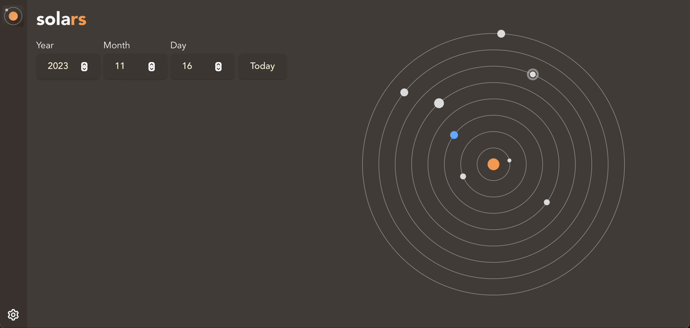

<div align="center">

<h1>solars</h1>
</div>

<p align="center"><i>Visualize the planets of our solar system</i></p>

## Overview

`solars` is a learning tool for exploring our solar system. Originally developed as a quick way to visualize planetary alignment on a given date, `solars` is also a foray into application design and the world of application development using [Tauri][tauri-app].

[tauri-app]: https://tauri.app/

## Preview

Enter a year, month, and day to see the relative alignment of the planets, or select one of the inputs and scroll up or down to fast-forward or rewind, respectively. Click **Today** to jump to today's date:

<div>

</div>

Some basic options allow you to customize the view.:

<div>

</div>

## Build

Clone this repository to your local machine. Since `solars` is a Tauri app, in order to build it, please follow the steps to build `solars` on your platform [here][tauri-build]. You will need one of Tauri's CLI utilities installed, e.g., `tauri-cli`:

```
cargo install tauri-cli
cargo tauri build
```

Currently, `solars` is not distributed on any app platforms.

[tauri-build]: https://tauri.app/v1/guides/building/

## Development

Clone this repository to your local machine. Since `solars` is a Tauri app, you can use the `tauri-cli` to run the development environment:

```
cargo install tauri-cli
cargo tauri dev
```

## License

This project is licensed under the MIT License.

### Contribution

Unless you explicitly state otherwise, any contribution intentionally submitted
for inclusion in `solars` by you, shall be licensed as MIT, without any
additional terms or conditions.
